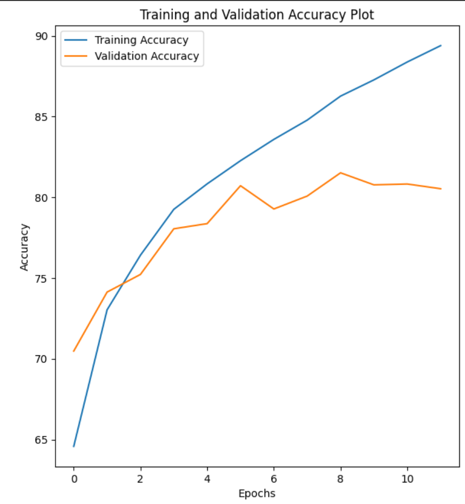
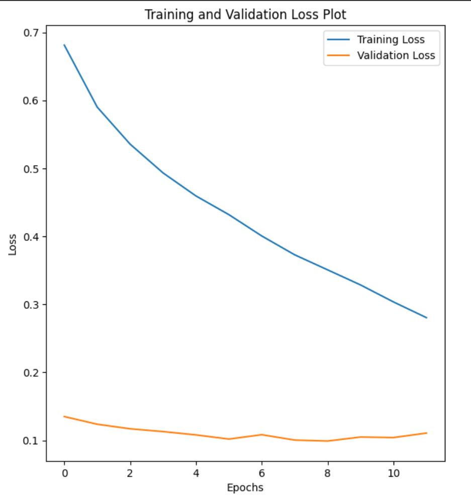

# Cats vs Dogs Image Classification Project
This repository contains a machine learning project focused on the classification of Cat/Dog Images from the Cats vs Dogs dataset. 
The project leverages the PyTorch framework to train a convolutional neural network(CNN) model capable of accurately predicting between different Animal Faces. 

## Data Source
The project utilizes the Animal Faces dataset, which is publicly available on Kaggle at the following URL: [https://www.kaggle.com/datasets/shaunthesheep/microsoft-catsvsdogs-dataset/data](https://www.kaggle.com/datasets/shaunthesheep/microsoft-catsvsdogs-dataset/data)

## Project Overview
The core of the project is to learn on how to build and train a convolutional neural network(CNN) using PyTorch. 
The model is trained on the Cats vs Dogs dataset to learn the distinct features of each type, enabling it to accurately classify between them.
The Jupyter Notebook included in this repository provides a detailed walkthrough of the model architecture, training process, and evaluation metrics.

## Data Acquisition and Preparation: 
To replicate the project results, it is necessary to download the Cats vs Dogs dataset from the specified Kaggle URL.
Ensure that the downloaded folders file is placed in the same directory as the Jupyter Notebook for data loading and processing.
Also edit the directory path inside the Jupyter notebook to the path of the folders

## Note: 
The project code assumes that the required data folders is present in the same directory as the Jupyter Notebook. Please follow the instructions above to acquire and prepare the data accordingly.

## Note 2:
The accuracy achieved is not so high which indirectly means there might be some overfitting which have to be worked on later.

## Training Results

The following plots illustrate the training and validation performance of the neural network:

### Model Accuracy

This plot shows the training and validation accuracy over the epochs.

### Model Loss

This plot shows the training and validation loss over the epochs.
